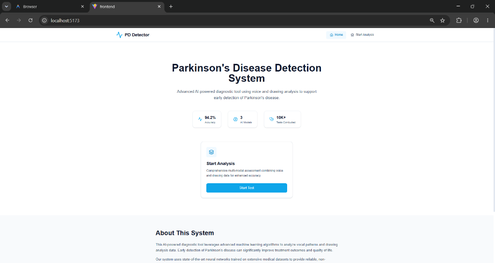
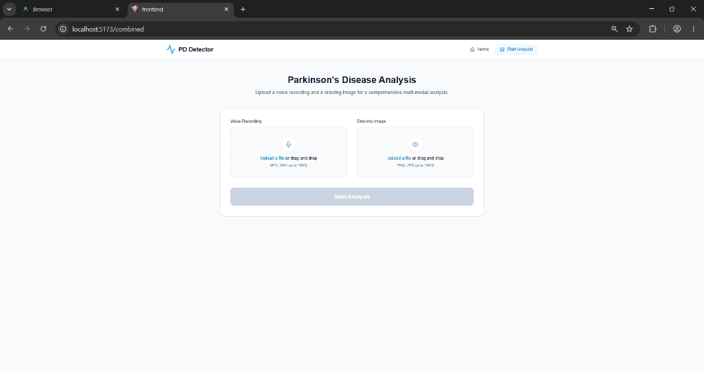
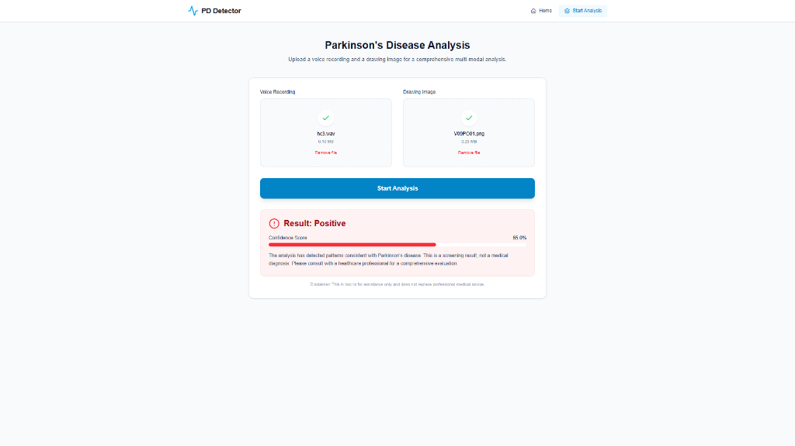
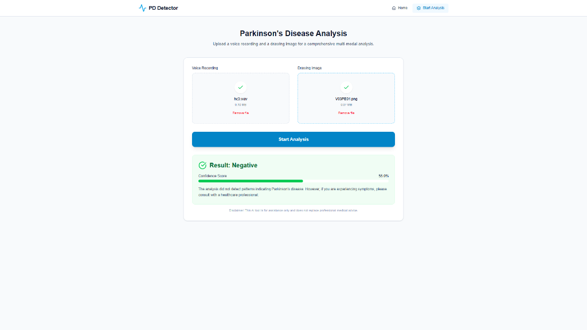

# 🧠 Multi-Modal-AI-System-for-Parkinson-s-Disease-Detection

> An AI-powered healthcare diagnostic support system that leverages **Machine Learning, Computer Vision, and Audio Signal Processing** to assist in the early detection of Parkinson's Disease through **voice recordings** and **hand-drawn spiral/wave images**.

---

# 📌 Overview

Multi-Modal-AI-System-for-Parkinson-s-Disease-Detection is a production-oriented multi-modal Artificial Intelligence application designed to assist in the early screening of Parkinson's Disease by analyzing multiple types of patient data. The system combines audio signal processing and computer vision to evaluate voice recordings and drawing patterns, providing a more comprehensive assessment than approaches that rely on a single data source.

Parkinson's Disease (PD) is a progressive neurological disorder that primarily affects movement, speech, handwriting, and motor coordination. Since many of these symptoms appear gradually, early identification can support timely clinical evaluation, improve treatment planning, and enhance patient care. This project explores how Artificial Intelligence can assist healthcare professionals by automatically identifying subtle patterns associated with Parkinson's Disease.

The application processes two complementary input modalities. Voice recordings are analyzed using audio feature extraction techniques, enabling the system to capture speech characteristics that may indicate neurological impairment. Drawing patterns are processed using computer vision techniques to evaluate motor control and handwriting behavior. These extracted features are then analyzed using trained Machine Learning models, and the predictions from both modalities are combined to produce a more robust assessment.

Built using Python, Machine Learning, Computer Vision, Audio Signal Processing, REST APIs, and Full-Stack Web Development, the platform provides an intuitive web interface where users can upload voice recordings and drawing samples, receive AI-generated predictions, and visualize diagnostic results through an interactive dashboard. The project demonstrates the practical implementation of multi-modal AI, medical image analysis, audio analytics, supervised machine learning, healthcare AI, and end-to-end full-stack application development.

This project is intended as an AI-assisted diagnostic support system for educational and research purposes. It is designed to demonstrate how multiple AI techniques can be integrated into a unified healthcare application and is not intended to replace professional medical diagnosis or clinical decision-making.

---

# 🚀 Key Features

* Multi-modal Parkinson's Disease prediction
* Voice-based analysis using MFCC feature extraction
* Drawing-based analysis using HOG feature extraction
* Combined multi-modal prediction model
* Random Forest ensemble classifier
* PCA-based feature dimensionality reduction
* SMOTE-based dataset balancing
* FastAPI REST API backend
* React.js frontend with responsive user interface
* Streamlit demo interface
* Real-time prediction workflow
* Modular API architecture
* End-to-end Machine Learning deployment

---

# 🏗️ System Architecture

```text
                         User

                          │
        ┌─────────────────┴─────────────────┐
        │                                   │
        ▼                                   ▼
 Voice Recording (.wav)          Spiral/Wave Drawing
        │                                   │
        ▼                                   ▼
 Audio Preprocessing              Image Preprocessing
        │                                   │
        ▼                                   ▼
 MFCC Feature Extraction          HOG Feature Extraction
        │                                   │
        └───────────────┬───────────────────┘
                        ▼
                Feature Fusion Layer
                        │
                        ▼
        Data Preprocessing & Normalization
                        │
                        ▼
         PCA Dimensionality Reduction
                        │
                        ▼
        Random Forest Classification
                        │
                        ▼
     Parkinson's Disease Prediction
                        │
                        ▼
          Results & Confidence Score
```

# ⚙️ Technology Stack

## Programming Language

* Python

---

## Backend

* FastAPI
* Uvicorn

---

## Frontend

* React.js
* Vite
* Tailwind CSS

---

## Machine Learning

* Scikit-learn
* Random Forest Classifier
* PCA
* SMOTE

---

## Audio Processing

* Librosa
* NumPy

---

## Image Processing

* OpenCV
* Scikit-Image

---

## Data Processing

* Pandas
* NumPy

---

# 🧠 Machine Learning Pipeline

## 🎤 Voice Analysis

The voice analysis module processes `.wav` audio recordings by extracting **Mel-Frequency Cepstral Coefficients (MFCCs)**. These features capture speech characteristics associated with Parkinson's Disease, including vocal instability and phonation irregularities.

### Voice Processing Steps

* Audio loading
* Signal preprocessing
* MFCC extraction
* Feature normalization
* Prediction

---

## ✍️ Drawing Analysis

The drawing module analyzes spiral or wave drawings using **Histogram of Oriented Gradients (HOG)** feature extraction to identify motor-control abnormalities and tremor-related patterns.

### Drawing Processing Steps

* Image preprocessing
* Grayscale conversion
* HOG feature extraction
* Feature normalization
* Prediction

---

## 🔀 Multi-Modal Feature Fusion

The extracted voice and drawing features are combined into a unified feature vector.

The combined feature vector undergoes:

* Feature Scaling
* PCA-based Dimensionality Reduction
* Random Forest Classification

The multi-modal approach leverages complementary information from both modalities to provide more reliable predictions than using a single input source.

---

## 🔄 Prediction Workflow

```text
                 User
                   │
                   ▼
      Upload Voice Recording (.wav)
                   │
                   │
      Upload Drawing Image
                   │
                   ▼
        Web Application (Frontend)
                   │
          REST API Request
                   │
                   ▼
        Prediction Backend Service
                   │
      ┌────────────┴────────────┐
      ▼                         ▼
Voice Processing Module   Image Processing Module
      │                         │
      ▼                         ▼
MFCC Feature Extraction   HOG Feature Extraction
      │                         │
      └────────────┬────────────┘
                   ▼
        Multi-Modal Feature Fusion
                   │
                   ▼
 Feature Scaling & Data Preprocessing
                   │
                   ▼
    Random Forest Prediction Model
                   │
                   ▼
  Parkinson's Disease Classification
                   │
                   ▼
  Prediction Confidence Generation
                   │
                   ▼
   Display Results on Web Dashboard
```
---

# 📷 Application Screenshots

### 🏠 System Dashboard & Landing Page

*Main Application Landing Dashboard showing system features, performance metrics, and quick start launcher.*

---

### 🎙️ Multi-Modal Analysis Interface

*Multi-Modal Diagnostic Upload Page for selecting voice recording (.wav) and drawing pattern (.png) files.*

---

### 📊 Diagnostic Screening Results

| Positive Screening Result | Negative Screening Result |
| :---: | :---: |
|  |  |
| *Parkinson's Disease Positive screening output with confidence score.* | *Parkinson's Disease Negative screening output with confidence score.* |

---

# 📂 Project Structure

```text
AI-Powered Multi-Modal Parkinson's Disease Detection System/
│
├── backend/                 # FastAPI REST backend API
│   ├── app.py               # Application endpoints & prediction routing
│   ├── utils.py             # Feature extraction routines (MFCC & HOG)
│   ├── models/              # Production machine learning models
│   ├── temp/                # Temporary audio/image upload cache
│   └── .env                 # Backend environment variables
│
├── frontend/                # React.js + Vite web application
│   ├── src/                 # React pages, components, & styling
│   ├── public/              # Static web assets & icons
│   ├── package.json         # Web application dependencies
│   ├── tailwind.config.js   # Tailwind CSS configuration
│   └── vite.config.js       # Vite dev server configuration
│
├── screenshots/             # Application UI screenshots & preview assets
│   ├── home_dashboard.png   # Main system dashboard screenshot
│   ├── multi_modal_analysis.png # Voice & drawing upload interface screenshot
│   ├── positive_detection_result.png # Positive screening result screenshot
│   └── negative_detection_result.png # Negative screening result screenshot
│
├── scripts/                 # Maintenance & utility scripts
│   ├── retrain.py           # Model retraining pipeline
│   └── fix_models.py        # Model serialization compatibility patch
│
├── models/                  # Archive of trained model checkpoints (.pkl)
│
├── notebooks/               # Jupyter research & training notebooks
│   ├── img_detection.ipynb  # HOG drawing feature extraction notebook
│   ├── multimodal.ipynb     # Multi-modal fusion model notebook
│   ├── voice_detection.ipynb# MFCC voice analysis notebook
│   └── scripts/             # Exported Colab python scripts
│
├── datasets/                # Diagnostic research datasets
│   ├── drawings/            # Spiral and wave drawing samples
│   └── voice/               # Voice recordings & feature dataset
│
├── venv/                    # Active Python virtual environment
├── .env                     # Global environment configuration
├── .gitignore               # Version control ignore rules
├── README.md                # Project documentation
├── requirements.txt         # Python dependencies specification
└── run_app.ps1              # 1-Click PowerShell application launcher
```

---

# 🌐 API Endpoints

| Endpoint   | Description                          |
| ---------- | ------------------------------------ |
| `/voice`   | Voice-based Parkinson's prediction   |
| `/drawing` | Drawing-based Parkinson's prediction |
| `/pro`     | Multi-modal Parkinson's prediction   |

---

# 📊 Model Performance

The final model demonstrated strong predictive performance during evaluation.

| Metric    | Value                      |
| --------- | -------------------------- |
| Accuracy  | 94%+                       |
| Precision | *Update with actual value* |
| Recall    | *Update with actual value* |
| F1-Score  | *Update with actual value* |

Evaluation methods:

* Accuracy
* Precision
* Recall
* F1 Score
* Confusion Matrix

---

# 💻 Installation

Clone the repository

```bash
git clone https://github.com/sarthak-engineer/Multi-Modal-AI-System-for-Parkinson-s-Disease-Detection.git
cd Multi-Modal-AI-System-for-Parkinson-s-Disease-Detection
```

Create a virtual environment

```bash
python -m venv venv
```

Activate the environment

### Windows

```bash
venv\Scripts\activate
```

### Linux/macOS

```bash
source venv/bin/activate
```

Install dependencies

```bash
pip install -r requirements.txt
```

---

# ▶️ Running the Backend

```bash
cd backend

uvicorn app:app --reload --port 8000
```

---

# ▶️ Running the Frontend

```bash
cd frontend

npm install

npm run dev
```
---

# 📷 Application Workflow

1. Upload a voice recording (`.wav`)
2. Upload a spiral or wave drawing image
3. Backend extracts MFCC features from the audio
4. Backend extracts HOG features from the image
5. Features are combined into a unified representation
6. The trained Random Forest model generates a prediction
7. Prediction result is displayed through the React interface

---

# 🎯 Applications

* AI-assisted healthcare research
* Parkinson's Disease screening support
* Educational Machine Learning projects
* Computer Vision applications
* Audio Signal Processing applications
* Healthcare AI demonstrations
* Full-Stack AI deployment reference

---

# 📈 Future Improvements

* Deep Learning-based multi-modal models
* CNN and Transformer-based architectures
* Real-time speech analysis
* Explainable AI (SHAP/LIME)
* Cloud deployment
* Docker containerization
* Mobile application support
* Clinical dataset expansion
* Continuous model improvement
* Integration with electronic health systems

---

# 🛡️ Disclaimer

This project is developed **solely for educational, research, and demonstration purposes**.

The predictions generated by this system **should not be considered a medical diagnosis** and must **not replace professional clinical evaluation or consultation with qualified healthcare professionals**.

---

# 👨‍💻 Author

**Sarthak.**

AI/ML Engineer | Python | Machine Learning | Deep Learning | Generative AI

* [LinkedIn](https://www.linkedin.com/in/sarthak-gowda-886b62269)

---

# ⭐ If you found this project useful

Please consider giving this repository a ⭐ on GitHub.

Your support is greatly appreciated!
